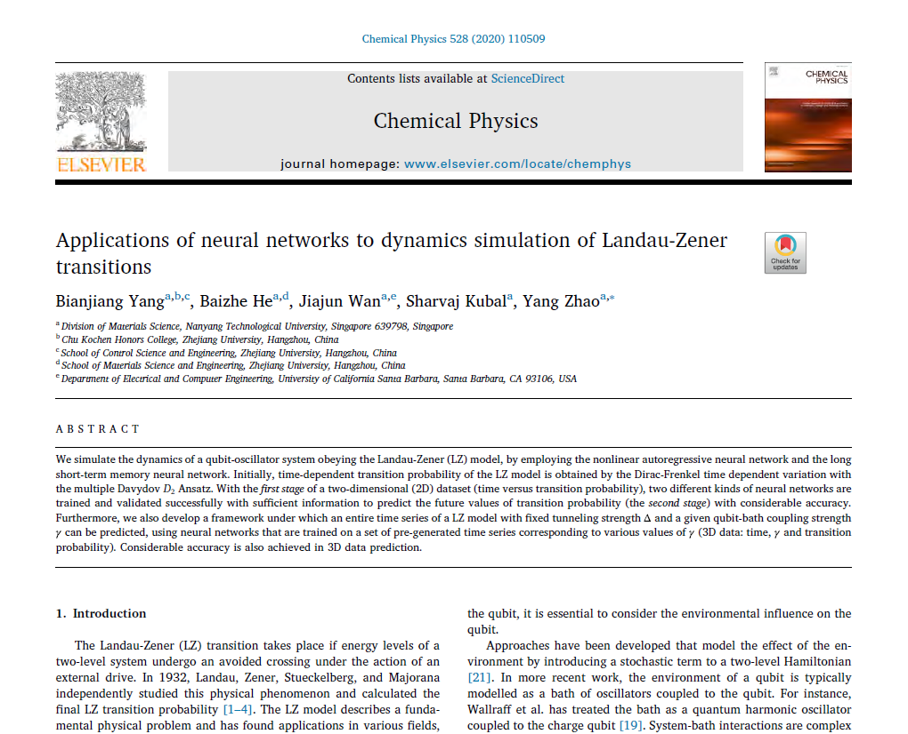

# Introduction
Official implementation of the Journal of Chemical Physics paper: "[Applications of neural networks to dynamics simulation of Landau-Zener transitions](https://www.sciencedirect.com/science/article/abs/pii/S030101041930802X)". In this project, we predicted LZ data in 2D/3D via LSTM and Narnet.

<center></center>
If there are bugs, pls open an issue.


# Dependencies

For MATLAB, you should install the "Neural Net Time Series" toolbox.

For Python, pls find the dependencies below.

# MATLAB-Narnet:

Steps to run the code:

Take pabc06 as an example.

* Copy the file(network_test.mat) which is the trained neural network into the folder "code" to replace the original file(also named network_test.mat) in the folder.

* Double click the file(predict.m) in the folder "code" to open the file using MATLAB.

* Change the parameters in the file(predict.m). The paremeters can be found in the file "/Networks&Parameters in predict.m/pabc06/06.txt". There are 6 parameters need to be changed in the first module of the code(which have been commented with "change parameter"). 

* Run the code and you will see the figure including predicted lines.

* Train_combined.m file is used to train the neural network.


# Python3-LSTM:

* Requirement: Python3, tensorflow, pandas, matplotlib, numpy, scipy

* The LSTM was trained in iMac. But it will also work well in Linux and Windows.

See our 3D prediction framework below.
<center></center>

# Results

<center></center>

<center>2D Prediction</center>

<center></center>

<center>3D Prediction</center>

# Acknowledgment

This work was done in [The Zhao Research Group](https://www3.ntu.edu.sg/home/zhaoyang/index.html), Nanyang Technological University, you may find some interesting projects from the [lab](https://www3.ntu.edu.sg/home/zhaoyang/index.html).

We thank [Zhongkai Huang](https://clkx.yznu.edu.cn/2019/0612/c5217a156985/page.htm), Yubing Liao and Frank Grossmann for helpful discussion and graphics assistance. Competitive Research
Programme (CRP) under Project No. NRFCRP5-2009-04 and from the Singapore Ministry of Education Academic Research Fund Tier 1 (Grant
Nos. RG106/15, RG102/17, and RG190/18) is gratefully acknowledged.


# Reference

Please cite this in your publication if our work helps your research. 

```
@article{yang2020applications,
  title={Applications of neural networks to dynamics simulation of Landau-Zener transitions},
  author={Yang, Bianjiang and He, Baizhe and Wan, Jiajun and Kubal, Sharvaj and Zhao, Yang},
  journal={Chemical Physics},
  volume={528},
  pages={110509},
  year={2020},
  publisher={Elsevier}
}
```

Pls contact me if you have any questions.

HomePage: https://jian-danai.github.io/

Email: yangbj@zju.edu.cn
